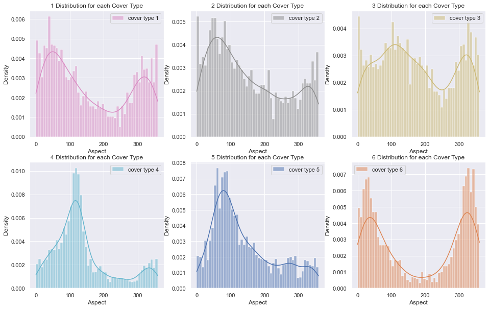

# Forest Cover Type Prediction
---

 The task was to predict the forest cover type (the predominant kind of cover) from strictly catographic variables. Comprehensive exploratory data anlysis to understand the importance and significance of the variables variables, identifying  outliers, correlations and peforming feature engineering to increase the accuracy of the prediction. 
    
* Data is available in the [UCI Machine Learning Repository](https://archive.ics.uci.edu/ml/datasets/Covertype).
 

---

